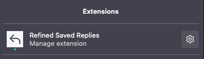
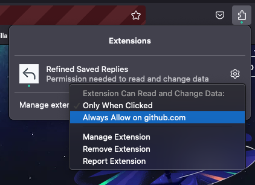

# Refined Saved Replies

A Browser extension for GitHub's [Saved Replies](https://docs.github.com/en/get-started/writing-on-github/working-with-saved-replies/using-saved-replies) that adds replies from a repository's `.github/replies.yml`.

Saved Replies are great, but oftentimes repository maintainers need a way to share common replies per-repository.
This extension modifies the Saved Replies for issues or pull requests on any repository with a `.github/replies.yml` file to include those replies.

## Usage

Get it on [Chrome Web Store > Refined Saved Replies](https://chrome.google.com/webstore/detail/refined-saved-replies/ngcinicnlicdndmpcfjjifononfcceih)! ✨

Install it from the [Firefox Add-ons > Refined Saved Replies](#TBD) page! 🦊

After installing the extension in Firefox, you'll need to authorize the extension to run on [https://github.com](https://github.com).

### Firefox Configuration

Find and select the Firefox add-ons icon in the top right of your browser.

Select the "Manage Your Extensions" button.

Select the "Always Allow on github.com" option, and you are ready to go.

## Development

See [`.github/CONTRIBUTING.md`](./.github/CONTRIBUTING.md), then [`.github/DEVELOPMENT.md`](./.github/DEVELOPMENT.md).
Thanks! 💖
